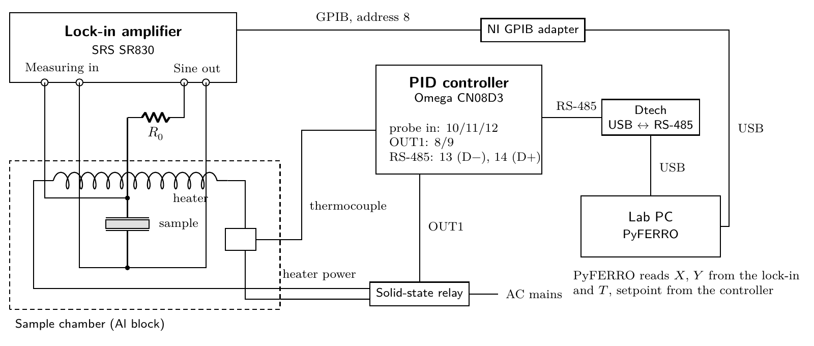

# PyFERRO — PHY445 phase-transition lab

Instrument control and data acquisition for a physics teaching lab: a lock-in amplifier
measures a sample's dielectric response while a PID controller ramps its temperature
through a phase transition. PyFERRO reads both instruments, plots live, and writes
self-describing data files. It replaces `FERRO v.2.vi`, a LabVIEW 2009 routine.

This repository holds the program and the lab manual for the experiment it serves.



## Try it without hardware

Needs [pixi](https://pixi.sh) only — it fetches Python and every dependency itself.

```bash
git clone https://github.com/loganl/PyFERRO.git
cd PyFERRO/pyferro
pixi run simulate          # the full GUI, driven by simulated instruments
pixi run -e test test      # the test suite: no hardware needed, GUI tests run offscreen
```

Simulation sits *below* the drivers, so the same parsing, scaling and file-writing code
runs as in the lab. Against real instruments it is `pixi run start`.

## Layout

| Path | What it is |
|---|---|
| `pyferro/ferro/` | the program: `gui/`, `acquisition.py` (the measurement loop), `instruments/` (drivers), `transports.py` (GPIB/serial), `config.py`, `datafile.py`, `analysis.py`, `sessionlog.py` |
| `pyferro/tools/` | `update.py` (the `git pull` before `pixi run start`) and `gpib_check.py` (`pixi run gpib`, a GPIB link diagnostic) |
| `pyferro/tests/` | drivers, wire-level protocol tests over a pty, GUI tests, version consistency |
| `pyferro/docs/` | `drivers-and-daq.md` and the instrument manuals |
| `ptmanual/` | LaTeX source of the lab manual, its figures and standalone TikZ sources |

**[`pyferro/README.md`](pyferro/README.md) is the complete documentation** — install,
wiring, taking data, file format, instrument protocols, code layout, tests and
releases. [`pyferro/docs/drivers-and-daq.md`](pyferro/docs/drivers-and-daq.md)
walks through the transports, drivers and measurement loop, and
[`pyferro/CHANGELOG.md`](pyferro/CHANGELOG.md) records each version.

## The hardware it talks to

| Instrument | Link | Protocol |
|---|---|---|
| SRS SR830 lock-in | GPIB (NI adapter), address 8 | IEEE 488.2 text commands, X/Y/R/θ in volts; its settings can also be set from the program |
| Omega CND3 PID controller | RS-485 via an FTDI USB adapter | Modbus ASCII/RTU, read-only |
| HP 34401A multimeter (optional) | GPIB, address 24 | `READ?`, Pt100 → °C (IEC 60751) |

The Instruments tab can also select the lab's previous lock-in, an **EG&G/PAR 5302**
(GPIB 12 on this rig), and a **Keithley 199** multimeter (GPIB 6).

The controller owns the heater; PyFERRO never writes to it. Instrument failures are
recorded as `nan` with a flag bit and the connection is reopened automatically, so a
dropped cable does not end a measurement.

The manuals for all five instruments are in `pyferro/docs/manuals/`, and the protocol
tests check the drivers against the example frames printed in them.

## How it ships

The lab PC runs a git clone of this repository (`C:\PyFERRO`) with pixi.
`pixi run start` does a `git pull --ff-only` first, so the lab always runs the latest
code on `main`; being offline just starts the copy already there. There is no
installer or bundle to build.

## Versioning

`MAJOR.MINOR.PATCH`, tagged `v<version>`. The number is written in exactly one place,
`__version__` in `pyferro/ferro/__init__.py`; the package metadata, the window title and
every data-file header derive from it, and a test fails if a second copy
appears or a tag disagrees. A file recorded in the lab names the version that produced
it, so it can always be traced back to the code.

## The lab manual

```bash
cd ptmanual && make        # builds the TikZ figures, then main.pdf
cd ptmanual && latexmk     # the same without make, for machines that lack it
cd ptmanual && make tagged # main-tagged.pdf, the tagged PDF/UA-2 edition for screen readers
```

It is built with **LuaLaTeX** from **TeX Live 2024 or newer** — the tagged-PDF
metadata and `luamml` are too new for older releases, and Debian's and Ubuntu's
packages lag behind. `ptmanual/.latexmkrc` and a `% !TEX program = lualatex` line in
every source file select the engine, so no flag is needed. The PDFs are committed,
so reading the manual needs no TeX at all. What to install, editor set-up and the
Overleaf route are in [`ptmanual/README.md`](ptmanual/README.md).
