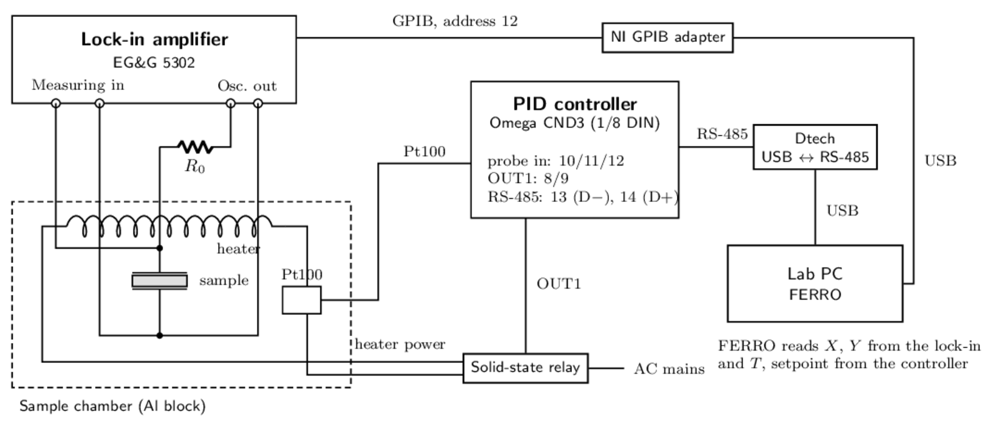

# PyFERRO — phase-transition data acquisition

Records **sample temperature** and the **lock-in X/Y signal** while an Omega CND3 PID
controller heats and cools the chamber. Replaces the LabVIEW routine `FERRO v.2.vi`.

| Instrument | Connection | Default |
|---|---|---|
| EG&G/PAR 5302 lock-in | NI GPIB adapter | `GPIB0::12::INSTR` |
| Omega CND3 PID controller (holds the Pt100 probe) | Dtech USB → RS-485 (FTDI) | Modbus ASCII, address 1, 9600 7E1 |
| HP 34401A multimeter (optional) | NI GPIB adapter | `GPIB0::24::INSTR`, Pt100 in 4-wire Ω |

PyFERRO only **reads**. It never changes setpoints or heater power, so the controller's
*COMMUNICATION WRITE* setting stays **OFF**.

This file is the complete documentation. [`CHANGELOG.md`](CHANGELOG.md) records what
changed per version; `docs/` holds the wiring diagram and the instrument manuals.

## 1. Install on the offline lab PC

Windows 10/11 64-bit, ~1.5 GB free disk.

1. Copy `PyFERRO-<version>-win64-offline.zip` over and **extract** it to a local folder,
   e.g. `C:\PyFERRO` (not inside the zip viewer, not a network drive).
2. Run **`INSTALL.bat`** once. It unpacks the bundled Python and adds a desktop shortcut.
   No internet is used.
3. Install drivers once, from offline installers placed in the bundle's `drivers/`:
   * **NI-VISA** + **NI-488.2** for the GPIB adapter. A 64-bit VISA is required
     (`C:\Windows\System32\visa64.dll`); 32-bit-only installs from the LabVIEW 2009 era
     cannot be used from 64-bit Python.
   * **FTDI VCP driver** for the Dtech adapter, only if it does not appear as a `COM`
     port in Device Manager.

`PyFERRO.bat` starts the program, `PyFERRO-simulation.bat` runs it without hardware, and
`PyFERRO-debug.bat` prints the VISA library, GPIB instruments and COM ports it can see,
then starts with a console for errors.

## 2. Hardware and wiring



Full size: `docs/wiring-diagram.pdf` (`wiring-diagram.pdf` in the bundle); source in
`docs/wiring-diagram.tex` and `ptmanual/tikz/fig-daq-wiring.tex`.

**RS-485** (two-wire half-duplex; the adapter's `RXD+`, `RXD-`, `GND` stay empty):

| Dtech terminal | CND3 terminal |
|---|---|
| `T/R+` | **14** (`D+`) |
| `T/R-` | **13** (`D−`) |

If the controller does not answer, swap the two wires first. Terminal numbers are those
of the 1/8 DIN size (CN08D3 = Delta DT340); other sizes number them differently.

**Controller settings** (Initial Setting mode): communication enabled, protocol ASCII,
address 1, 9600 baud, 7 data bits, even parity, 1 stop bit, communication write OFF.
Other settings work — use *Auto-detect settings*. The CND3 cannot use 7N1, 8O2 or 8E2.

**Identifying the controller:** during the first 3 s after power-on the top display's
4th character is `C` when RS-485 is fitted, and the bottom display's first two letters
are the OUT1/OUT2 types (`R` relay, `V` voltage pulse, `C` current, `L` linear voltage,
`S` SSR, `N` none). The lab unit is 43.8 × 90.9 mm behind the bezel (1/8 DIN, cutout
44.5 × 91.5 mm), 100–240 V AC.

**Lock-in:** GPIB address 12. Nothing else to set: the sensitivity and expand settings
are read from the instrument before every measurement.

**Safety:** the chamber is hot above 100 °C and the lab manual forbids exceeding 160 °C.
PyFERRO warns above that but is not a safety device; the controller and relay are.

## 3. Taking data

1. **Instruments tab:** pick the Dtech COM port (FTDI ports listed first), press
   **Test lock-in** and **Test controller**. A green ✔ shows sensitivity, time constant,
   PV/SV, firmware.
2. **Run tab:** enter a sample/run name (becomes the file name), operator, drive details,
   notes, and the save folder.
3. **▶ Start monitoring** shows live data without saving. **● Record** opens a file;
   pressing it again closes that file, and the next recording opens a new one.
   **■ Stop** disconnects.
4. Set the **reading interval** to at least ~5× the lock-in time constant.
   *Save only if ΔT ≥* reproduces the old LabVIEW behaviour; leave it off to record
   every reading.
5. **Temperature from** (Run tab) selects what goes in column 1 of the file: the
   *CND3 controller* probe (normal) or the *Multimeter Pt100*. Both are recorded
   whenever available — `PV_C` from the controller, `T_dmm_C` from the multimeter.
   To use the multimeter, tick **Also read the multimeter** on the Instruments tab and
   check its GPIB address (`GPIB0::24::INSTR`) and whether the reading is ohms or °C.

Status lights: green OK, red not answering (hover for the reason), grey unused. A failed
reading never stops a run — the value becomes `nan`, a flag is set, and the instrument is
reopened after three consecutive failures. The temperature tile turns red above the
chamber limit (default 160 °C).

Settings persist in `%USERPROFILE%\.ferro\settings.json`; delete it to reset, or set
`FERRO_CONFIG_DIR` for a per-group file.

## 4. Data files

`<name>_YYYYMMDD_HHMMSS.txt`, never overwritten, flushed after every row.

```
# software: pyferro 1.0.0
# sample: BTO_1V_37kHz
# temperature_source: CND3 controller PV
# lockin_sensitivity: 50 mV
# lockin_time_constant: 200 ms
# controller_sv_c: 150.0
# column 1: T_C - sample temperature used for plots (degC)
# T_C	X_V	Y_V	time_s	R_V	theta_deg	SV_C	PV_C	T_dmm_C	sens_V	direction	segment	flags
2.71944e+01	1.00420e-04	-2.32000e-03	0.00000e+00	...
```

| # | Column | Meaning |
|---|---|---|
| 1–3 | `T_C`, `X_V`, `Y_V` | as in the LabVIEW files: temperature (°C), lock-in X and Y (V rms) |
| 4 | `time_s` | seconds since the run started |
| 5–6 | `R_V`, `theta_deg` | √(X²+Y²) and atan2(Y, X) |
| 7–8 | `SV_C`, `PV_C` | controller setpoint and temperature |
| 9 | `T_dmm_C` | multimeter Pt100 temperature (`nan` when unused) |
| 10 | `sens_V` | lock-in full-scale sensitivity at that moment |
| 11–12 | `direction`, `segment` | +1 heating, −1 cooling, 0 steady; segment increments at each turn-around |
| 13 | `flags` | 1 lock-in overload, 2 lock-in error, 4 controller error, 8 multimeter error (added together) |

Missing values are `nan`. Load with `numpy.loadtxt(path)`, or:

```python
names = "T_C X_V Y_V time_s R_V theta_deg SV_C PV_C T_dmm_C sens_V direction segment flags".split()
df = pd.read_csv(path, sep=r"\s+", comment="#", names=names)
heating = df[df.direction == 1]
```

*Old LabVIEW file format* writes only T, X, Y with no header (readable by `plot.vi`);
the metadata then goes to a `.json` file of the same name.

**Session log.** Everything the log panel shows is also written to
`~/.ferro/logs/pyferro_<start>.log`, from the moment the program starts — so the
messages that explain a run (an instrument that never answered, an auto-detect that
found nothing) survive even though they happened before recording began. Each data file
names it in its header (`# session_log:`) and gets a copy beside it as `<name>.log` when
the recording closes, so the data and its explanation travel together. The twenty newest
logs are kept; a log that cannot be written is skipped silently and never interrupts a
measurement.

## 5. Troubleshooting

| Symptom | Cause and fix |
|---|---|
| "PyFERRO is not installed yet" | `INSTALL.bat` not run, or the folder moved. |
| Qt/DLL errors at start-up | Extracted to a network drive or inside the zip viewer; extract to a local disk. |
| `Could not open GPIB0::12::INSTR` | NI-VISA/NI-488.2 missing, adapter unplugged, or wrong address — check NI MAX. |
| *Find* lists no VISA instruments | 32-bit-only NI-VISA; install a current one with `visa64.dll`. |
| `expected ID 5302, instrument answered …` | Another instrument at that GPIB address. |
| X/Y values ×10 off | Check the EXPAND (`EX`) indicator; PyFERRO accounts for it, the LabVIEW VI did not. |
| X/Y tile red "OVERLOAD" | Signal beyond 120 % of full scale — use a less sensitive range. |
| Readings jump between rows | Interval shorter than ~5× the time constant. |
| `No valid reply from CND3` | Wrong COM port, wires swapped (14 = D+, 13 = D−), communication disabled, or different settings — run *Auto-detect settings*. |
| `temperature sensor not connected` | The controller reports a probe fault (`8003H`); check terminals 10/11/12. |
| `controller initialising` | Normal for a few seconds after power-on (`8002H`). |
| Temperature in °F | The controller is set to Fahrenheit; PyFERRO records what it reports. |
| COM port disappears | FTDI/driver issue or unplugged adapter; press *Refresh* — the loop reconnects by itself. |
| Nothing is saved | The Record button must be red; check the log panel. |
| "Cannot save here" / write error mid-run | Folder read-only or the USB drive vanished; rows already written are intact. |
| Fewer rows than expected | *Save only if ΔT ≥* is set. |
| Plots slow after hours | Press **Clear plots**; the file is unaffected. |

## 6. Instrument protocols

Manuals in `docs/manuals/` (`manuals/` in the bundle). `tests/test_protocols.py` checks
the code against the example frames printed there.

**EG&G 5302** (manual chapters 8–9): `ID` → `5302`; `XY` → X and Y with **±10000 = full
scale** (±12000 max); `SEN`/`SEN n` sensitivity index 0–21 (100 nV … 1 V, 1-2-5);
`XTC`/`XTC n` time-constant index 0–18; `EX` → 1 when Expand X is on (×10);
`FRQ` → reference frequency in mHz.

`V = counts / 10000 × full_scale`, divided by 10 when expand is on. `SEN` and `EX` are
read before every `XY`. `XY` is the compound command `X;Y`, so the two numbers arrive
either on one line (separated by the `DD` delimiter) or as two terminated lines — the
driver reads a second line when only one number arrives. GPIB (address 12) or RS-232;
over RS-232 the instrument echoes characters and ends each exchange with `*` (OK) or
`?` (error/overload/unlock), at 9600 7E1.

**Omega CND3 / Delta DT340:** Modbus ASCII (default) or RTU, function 03H reads up to
8 words, 06H writes one. PV and SV are read in one request.

| Register | Content |
|---|---|
| `1000H` | present value (PV), signed, 0.1° units |
| `1001H` | set value (SV), signed, 0.1° units |
| `1005H` | control method: 0 PID, 1 ON/OFF, 2 manual, 3 fuzzy |
| `1012H` | output 1 level, 0.1 % units |
| `102AH` | LED status: bit 2 = °C, bit 3 = °F |
| `102FH` | firmware version (`0x0100` = V1.00) |
| `103CH` | run/stop: 0 STOP, 1 RUN, 2 END, 3 HOLD |

PV values `8002H` initialising, `8003H` sensor not connected, `8004H` sensor input error,
`8006H` ADC error, `8007H` memory error are faults, not temperatures. *Auto-detect* tries
ASCII then RTU across the documented baud rates and framings, reading `102FH`.
Limitation: during a ramp `1001H` holds the programmed setpoint; the moving setpoint
(`1036H`, program mode) is not read.

**HP 34401A:** `READ?` returns the displayed value. In 4-wire ohms that is the Pt100
resistance, converted with IEC 60751 (`R = R₀(1 + AT + BT²)`, A = 3.9083×10⁻³,
B = −5.775×10⁻⁷). A reading far from 100–200 Ω raises an error naming the likely cause.

## 7. Code layout

```
ferro/gui/          main_window.py  window, plots, readouts, log
                    setup_panel.py  instrument settings, Test / Auto-detect
                    widgets.py      status lights, readouts, background tasks
ferro/acquisition.py   the measurement loop: open, read, log, retry
ferro/instruments/  lockin5302.py, cnd3.py, hp34401a.py, simulated.py
ferro/transports.py VisaTransport (GPIB), SerialTransport (RS-232 echo + prompt)
ferro/config.py     settings dataclasses, saved as JSON
ferro/datafile.py   the writer
ferro/analysis.py   ramp-direction tracking
```

Each loop pass reads the controller, the multimeter if enabled, then the lock-in;
picks the temperature source; updates direction and segment; emits the row to the GUI;
writes it when recording; sleeps to the next tick without catching up. Instrument I/O
happens only on the acquisition thread and reaches the GUI through Qt signals; *Test*
buttons and the stop sequence run as short-lived worker tasks; each transport serialises
its own calls with a lock.

## 8. Tests and simulation

```bash
pixi run start                     # run from source against the real instruments
pixi run simulate                  # the GUI with simulated instruments
pixi run -e test test              # everything (GUI tests run offscreen)
pixi run -e test test -k protocol  # one group
```

`pixi` installs the environment on first use; no other setup is needed on a development
machine (macOS, Linux or Windows).

| File | Covers |
|---|---|
| `tests/test_core.py` | scaling, parsing, register decoding, Pt100, data files, direction tracking, settings, a simulated run |
| `tests/test_protocols.py` | real serial/Modbus code over a pty against manual-accurate emulators (skipped on Windows) |
| `tests/test_gui.py` | record/stop cycles, run-name guard, one file per recording, settings persistence |
| `tests/test_version.py` | one version everywhere, matching the git tag |

Simulated instruments sit **below** the drivers, so the same parsing and scaling code
runs: a shared fake sample ramps 25 → 150 → 25 °C at 30 °C/min with a peak at 122 °C,
the lock-in answers `ID`/`SEN`/`XTC`/`EX`/`FRQ`/`XY` with counts scaled to the current
range, and the controller exposes the CND3 registers. Simulated runs show an orange
banner and `simulation: True` in the file header. Simulation cannot reproduce timing,
bus noise, wiring faults or GPIB itself — check those with the *Test* buttons and
`PyFERRO-debug.bat`.

## 9. Building the offline bundle

Built on a Mac/Linux machine **with** internet, then carried over.

```bash
pixi global install pixi-pack     # once; pixi itself from https://pixi.sh
cd pyferro
pixi run -e test test
./packaging/build_offline.sh
```

The first build downloads ~320 MB of Windows packages into `dist/.pixi-pack-cache`.
Result:

```
dist/PyFERRO-<version>-win64-offline.zip
├── INSTALL.bat, PyFERRO.bat, PyFERRO-simulation.bat, PyFERRO-debug.bat
├── environment-win-64.tar   Windows Python, PySide6, pyvisa, minimalmodbus, …
├── tools/pixi-unpack.exe    unpacker, no internet needed
├── app/ferro/               the source that runs
├── manuals/, wiring-diagram.pdf, README.md
└── drivers/                 put NI-VISA / NI-488.2 / FTDI installers here
```

Updating an installed copy: for code-only changes replace `app\ferro`; after a
dependency change delete the lab PC's `env` folder and run `INSTALL.bat` again. The
build script is bash — on Windows use WSL or Git Bash.

## 10. Versioning and releases

One number, in one place:

```python
# ferro/__init__.py
__version__ = "1.0.0"
```

`pyproject.toml` takes it dynamically, `packaging/build_offline.sh` reads that line for
the zip name, the window title and every data-file header show it, `pixi.toml` has no
version field, and the release is tagged `v<version>`. `tests/test_version.py` fails if a
second copy appears or the tag disagrees.

To release: edit `__version__`, add a `## 1.1.0 — <date>` section to `CHANGELOG.md`,
commit, then run the release script — it checks, tests, tags, pushes and builds:

```bash
git commit -am "PyFERRO 1.1.0"
./packaging/release.sh --dry-run   # prints every step, changes nothing
./packaging/release.sh             # add --publish to attach the zip to a GitHub release
```

It refuses to continue on a dirty tree, off `main`, behind `origin`, when the tag
already exists, when the changelog has no section for the version, or when a test fails.
The equivalent by hand:

```bash
pixi run -e test test
git tag -a v1.1.0 -m "PyFERRO 1.1.0"
git push && git push --tags
./packaging/build_offline.sh
```

Patch: fixes and docs. Minor: features, new options, a column added on the right.
Major: data-layout or workflow changes that break existing analysis scripts.
