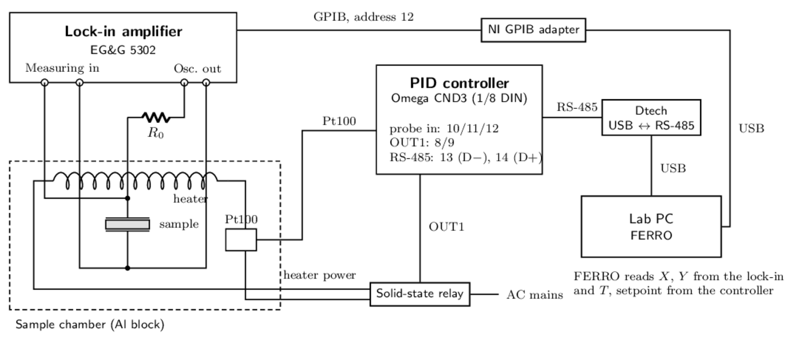

# PyFERRO — phase-transition data acquisition

Records **sample temperature** and the **lock-in X/Y signal** while an Omega CND3 PID
controller heats and cools the chamber. Replaces the LabVIEW routine `FERRO v.2.vi`.

| Instrument | Connection | Default |
|---|---|---|
| EG&G/PAR 5302 lock-in | NI GPIB adapter | `GPIB0::12::INSTR` |
| Omega CND3 PID controller (holds the control thermocouple) | Dtech USB → RS-485 (FTDI) | Modbus ASCII, address 1, 9600 7E1 |
| HP 34401A multimeter (optional) | NI GPIB adapter | `GPIB0::24::INSTR`, Pt100 in 4-wire Ω |

Other models can be chosen on the Instruments tab, for rigs built differently: an SRS
SR830 lock-in (GPIB 8 on this rig) and a Keithley 199 multimeter (GPIB 6).

PyFERRO **reads** the controller and never changes its setpoints or heater power, so
the controller's *COMMUNICATION WRITE* setting stays **OFF**. The 5302 lock-in is the
one instrument it can set, from the Lock-in tab, and only when asked (§3).

This file is the complete documentation. [`CHANGELOG.md`](CHANGELOG.md) records what
changed per version; [`docs/drivers-and-daq.md`](docs/drivers-and-daq.md) explains the
code that talks to the instruments; `docs/` also holds the wiring diagram and the
instrument manuals.

## 1. Install on the lab PC

Windows 10/11 64-bit. The lab PC runs a git clone at `C:\PyFERRO`.

1. Install [Git for Windows](https://git-scm.com/download/win) and
   [pixi](https://pixi.sh) (in PowerShell:
   `powershell -ExecutionPolicy ByPass -c "irm -useb https://pixi.sh/install.ps1 | iex"`).
   Neither needs admin rights.
2. Clone: `git clone https://github.com/loganl/PyFERRO.git C:\PyFERRO`.
3. Install the drivers once:
   * **NI-VISA** + **NI-488.2** for the GPIB adapter. A 64-bit VISA is required
     (`C:\Windows\System32\visa64.dll`); 32-bit-only installs from the LabVIEW 2009 era
     cannot be used from 64-bit Python.
   * **FTDI VCP driver** for the Dtech adapter, only if it does not appear as a `COM`
     port in Device Manager.
4. Start it from a terminal in `C:\PyFERRO\pyferro`:
   * `pixi run start` pulls the latest code (§8), then runs against the instruments;
   * `pixi run simulate` runs without hardware;
   * `pixi run gpib` diagnoses the lock-in's GPIB link (§5).

   The first start downloads Python and every dependency into `.pixi\` (allow
   ~1.5 GB of disk); later starts reuse it. After that, a start needs no internet:
   offline, the update step says so and the program starts as it is.

## 2. Hardware and wiring



Full size: `docs/wiring-diagram.pdf`; source in
`docs/wiring-diagram.tex` and `ptmanual/tikz/fig-daq-wiring.tex`.

**RS-485** (two-wire half-duplex; the adapter's `RXD+`, `RXD-`, `GND` stay empty):

| Dtech terminal | CND3 terminal |
|---|---|
| `T/R+` | **14** (`D+`) |
| `T/R-` | **13** (`D−`) |

If the controller does not answer, swap the two wires first. Terminal numbers are those
of the 1/8 DIN size (CN08D3 = Delta DT340); other sizes number them differently.

**Controller settings** (Initial Setting mode): communication enabled, protocol ASCII,
address 1, 9600 baud, 7 data bits, even parity, 1 stop bit, communication write OFF.
Other settings work — use *Auto-detect settings*. The CND3 cannot use 7N1, 8O2 or 8E2.

**Identifying the controller:** during the first 3 s after power-on the top display's
4th character is `C` when RS-485 is fitted, and the bottom display's first two letters
are the OUT1/OUT2 types (`R` relay, `V` voltage pulse, `C` current, `L` linear voltage,
`S` SSR, `N` none). The lab unit is 43.8 × 90.9 mm behind the bezel (1/8 DIN, cutout
44.5 × 91.5 mm), 100–240 V AC.

**Lock-in:** GPIB address 12. The sensitivity and expand settings are read from the
instrument with every reading, so X and Y are always scaled correctly. The rest of the
set-up follows the lab manual's 5302 table: *Test lock-in* compares the instrument with
it, and the Lock-in tab can set it (§3).

**Multimeter (optional):** the HP 34401A must be switched to **4-wire Ω** on its front
panel — PyFERRO does not change its function, and on 2026-09-29 it was found set to DC
volts. The Keithley 199 is set to ohms by PyFERRO on every connection and picks 2- or
4-wire by whether the SENSE leads are connected, but its **FRONT/REAR** input switch is
mechanical: it must select the terminals the Pt100 is wired to.

**Safety:** the chamber is hot above 100 °C and the lab manual forbids exceeding 160 °C.
PyFERRO warns above that but is not a safety device; the controller and relay are.

## 3. Taking data

1. **Instruments tab:** check the lock-in **Model** (EG&G 5302 on this rig), pick the
   Dtech COM port (FTDI ports listed first), press **Test lock-in** and
   **Test controller**. A green ✔ shows the sensitivity, time constant and reference
   frequency, and PV/SV, output level, control mode and firmware. For the 5302, a table
   underneath compares every setting with the lab manual's and says which key changes
   any that differ; starting a recording repeats the check and logs any difference as a
   warning.
2. **Lock-in tab (5302):** *Read from lock-in* shows its settings; change them there and
   press *Apply to lock-in* (it lists the commands and asks first), or press
   *Lab-manual values* to fill in the lab manual's table, then Apply. Only what differs is
   sent, and the settings are read back afterwards. This works during a run too: the
   change is sent between samples and written into the data file. AC/DC, FLOAT/GND
   and the phase tuning stay on the front panel.
3. **Run tab:** enter a sample/run name (becomes the file name), operator, drive details,
   notes, and the save folder.
4. **▶ Start monitoring** (F5) shows live data without saving. **● Record** (Ctrl+R)
   opens a file, starting monitoring if needed; pressing it again closes that file, and
   the next recording opens a new one. **■ Stop** disconnects.
5. Set the **reading interval** to at least ~5× the lock-in time constant.
   *Save only if ΔT ≥* reproduces the old LabVIEW behaviour; leave it off to record
   every reading.
6. **Temperature from** (Run tab) selects what goes in column 1 of the file: the
   *CND3 controller* probe (normal) or the *Multimeter Pt100*. Both are recorded
   whenever available — `PV_C` from the controller, `T_dmm_C` from the multimeter.
   To use the multimeter, tick **Also read the multimeter** on the Instruments tab and
   check its model, its GPIB address (`GPIB0::24::INSTR` for the 34401A,
   `GPIB0::6::INSTR` for the Keithley 199 on this rig) and whether the reading is ohms
   (a Pt100, converted here) or already °C (34401A only).

The tiles above the plots show the sample temperature, setpoint, ramp direction and
rate, X, Y and R/θ; the plots show temperature against time and X and Y against
temperature, heating and cooling in different colours.

Status lights: green OK, red not answering (hover for the reason), grey unused. A failed
reading never stops a run — the value becomes `nan`, a flag is set, and the instrument is
reopened after three consecutive failures. The first three temperatures after the
controller or multimeter connects are discarded (`nan`, flag 16) so a start-up glitch
cannot squash the plot. The temperature tile turns red above the
chamber limit (default 160 °C).

Settings persist in `%USERPROFILE%\.ferro\settings.json`; delete it to reset, or set
`FERRO_CONFIG_DIR` for a per-group file.

## 4. Data files

`<name>_YYYYMMDD_HHMMSS.txt`, never overwritten, flushed after every row.

```
# created: 2026-09-29T15:02:11
# software: pyferro 1.1.0
# sample: BTO_1V_37kHz
# temperature_source: CND3 controller PV
# lockin_model: 5302
# lockin_sensitivity: 50 mV
# lockin_time_constant: 200 ms
# lockin_setup_check: matches the lab manual's 5302 table
# controller_sv_c: 150.0
# column 1: T_C - sample temperature used for plots (degC)
# T_C	X_V	Y_V	time_s	R_V	theta_deg	SV_C	PV_C	T_dmm_C	sens_V	direction	segment	flags
2.71944e+01	1.00420e-04	-2.32000e-03	0.00000e+00	...
```

| # | Column | Meaning |
|---|---|---|
| 1–3 | `T_C`, `X_V`, `Y_V` | as in the LabVIEW files: temperature (°C), lock-in X and Y (V rms) |
| 4 | `time_s` | seconds since the run started |
| 5–6 | `R_V`, `theta_deg` | √(X²+Y²) and atan2(Y, X) |
| 7–8 | `SV_C`, `PV_C` | controller setpoint and temperature |
| 9 | `T_dmm_C` | multimeter Pt100 temperature (`nan` when unused) |
| 10 | `sens_V` | lock-in full-scale sensitivity at that moment |
| 11–12 | `direction`, `segment` | +1 heating, −1 cooling, 0 not yet known; segment increments at each turn-around. The column switches 1–2 min after a turn; the `# Ramp turned … at T °C, t = … s` line in the file gives where it really was |
| 13 | `flags` | 1 lock-in overload, 2 lock-in error, 4 controller error, 8 multimeter error, 16 temperature discarded just after connecting (added together) |

Missing values are `nan`. Load with `numpy.loadtxt(path)`, or:

```python
names = "T_C X_V Y_V time_s R_V theta_deg SV_C PV_C T_dmm_C sens_V direction segment flags".split()
df = pd.read_csv(path, sep=r"\s+", comment="#", names=names)
heating = df[df.direction == 1]
```

*Old LabVIEW file format* writes only T, X, Y with no header (readable by `plot.vi`);
the metadata then goes to a `.json` file of the same name.

**Events inside the file.** Anything that changes what the numbers mean is written into
the data file as a `#` comment line at the moment it happens — a sensitivity or time
constant change, and on the 5302 any change of reference, oscillator level or
frequency, filter, reserve, input or phase (checked every minute, and at once after a
change from the Lock-in tab, which is itself recorded), an overload starting or clearing, the controller switching to STOP, a
changed reading interval or temperature source, edited notes. `numpy.loadtxt` and pandas
skip these lines, so nothing breaks; the header also names the port each instrument used
(`# connection_lockin:`, `# connection_pid:`).

**Session log.** Everything the log panel shows is also written to
`~/.ferro/logs/pyferro_<start>.log`, from the moment the program starts — so the
messages that explain a run (an instrument that never answered, an auto-detect that
found nothing) survive even though they happened before recording began. Each data file
names it in its header (`# session_log:`) and gets a copy beside it as `<name>.log` when
the recording closes, so the data and its explanation travel together. The twenty newest
logs are kept; a log that cannot be written is skipped silently and never interrupts a
measurement.

## 5. Troubleshooting

| Symptom | Cause and fix |
|---|---|
| `update: …` line at start | `pixi run start` says what its `git pull` did. Offline, a local edit in the way, or a folder that is not a clone never stops the start; if it says the dependencies changed, close and start again. |
| `pixi` or `git` is not recognised | Not installed, or the terminal was opened before installing; install it (§1) and open a new terminal. |
| Qt/DLL errors at start-up | The clone is on a network drive; clone to a local disk. |
| `Could not open GPIB0::12::INSTR` | NI-VISA/NI-488.2 missing, adapter unplugged, or wrong address — check NI MAX. |
| Lock-in connects only sometimes | Run `pixi run gpib`: it opens a fresh connection twenty times, as a program start does, and reports the success rate. Use it before and after reseating a connector or swapping a cable, rather than trusting a single Test. |
| NI MAX says the 5302 "did not respond to a \*IDN? query" | Normal: the 5302 predates `*IDN?` (it answers `ID`). The scan did find it. |
| *Find* lists no VISA instruments | 32-bit-only NI-VISA; install a current one with `visa64.dll`. |
| GPIB reads all time out, but the bus enumerates | **Another instrument on the chain is powered off.** GPIB's handshake needs every connected device powered; an unpowered one holds NRFD/NDAC low, which also makes a scan "find" a device that never answers. Switch the multimeter on — even when PyFERRO is not using it — or take it out of the cable chain. |
| Readings arrive far slower than the interval | An instrument that is not answering costs its whole timeout every sample. The log says which one, every 30 s. |
| `expected ID 5302, instrument answered …` | Another instrument at that GPIB address. |
| X values ×10 off | Check the EXPAND (`EX`) indicator; it multiplies X only. PyFERRO accounts for it, the LabVIEW VI did not. |
| X/Y tile red "OVERLOAD" | Signal beyond 120 % of full scale — use a less sensitive range. |
| "Lock-in settings differ from the lab manual" | A setting is not the lab manual's value; the Instruments tab's table says which key changes it, or use the Lock-in tab. A warning only — recording goes ahead. |
| Readings jump between rows | Interval shorter than ~5× the time constant. |
| `No valid reply from CND3` | Wrong COM port, wires swapped (14 = D+, 13 = D−), communication disabled, or different settings — run *Auto-detect settings*. |
| `temperature sensor not connected` | The controller reports a probe fault (`8003H`); check terminals 10/11/12. |
| `controller initialising` | Normal for a few seconds after power-on (`8002H`). |
| `controller sent …H, a status code, not a temperature` | A value below −999.9 °C, which no input can read. The first readings after connecting are discarded for this reason (flag 16); if it recurs mid-run, check the probe wiring. |
| `multimeter reads … expected ~100-200 ohm` | The 34401A is not in 4-wire Ω (set it on the front panel), or the Pt100 is not connected. |
| Keithley 199 reads `OOHM+9.999999E+9` / "overflow" | Open circuit: nothing across the inputs in use. Check the Pt100 leads and that the FRONT/REAR switch selects the terminals they are on. |
| Temperature in °F | The controller is set to Fahrenheit; PyFERRO records what it reports. |
| COM port disappears | FTDI/driver issue or unplugged adapter; press *Refresh* — the loop reconnects by itself. |
| Nothing is saved | The Record button must be red; check the log panel. |
| "Cannot save here" / write error mid-run | Folder read-only or the USB drive vanished; rows already written are intact. |
| Fewer rows than expected | *Save only if ΔT ≥* is set. |
| Plots slow after hours | Press **Clear plots**; the file is unaffected. |

## 6. Instrument protocols

Manuals in `docs/manuals/`. `tests/test_protocols.py` checks
the code against the example frames printed there.

**EG&G 5302** (manual chapters 8–9): `ID` → `5302`; `XY` → X and Y with **±10000 = full
scale** (±12000 max); `SEN`/`SEN n` sensitivity index 0–21 (100 nV … 1 V, 1-2-5);
`XTC`/`XTC n` time-constant index 0–18; `EX` → 1 when Expand X is on (x channel ×10, y unaffected);
`FRQ` → reference frequency in mHz. The front-panel set-up is read with `IE` (reference
INT/TTL/EXT), `OA` and `OF` (oscillator level and frequency, each as a count and a
range), `DR` (dynamic reserve), `FLT` (filter), `PREAMP` (signal input) and `P`
(reference phase), and each command with a number sets that value — how the Lock-in tab
applies the lab manual's table. AC/DC coupling and FLOAT/GND have no command.

`V = counts / 10000 × full_scale`, with X (only) divided by 10 when expand is on. `SEN` and `EX` are
read before every `XY`. `XY` is the compound command `X;Y`, so the two numbers arrive
either on one line (separated by the `DD` delimiter) or as two terminated lines — the
driver reads a second line when only one number arrives. GPIB (address 12) or RS-232;
over RS-232 the instrument echoes characters and ends each exchange with `*` (OK) or
`?` (error/overload/unlock), at 9600 7E1.

**Omega CND3 / Delta DT340:** Modbus ASCII (default) or RTU, function 03H reads up to
8 words, 06H writes one. PV and SV are read in one request.

| Register | Content |
|---|---|
| `1000H` | present value (PV), signed, 0.1° units |
| `1001H` | set value (SV), signed, 0.1° units |
| `1005H` | control method: 0 PID, 1 ON/OFF, 2 manual, 3 fuzzy |
| `1012H`, `1013H` | output 1 and output 2 levels, 0.1 % units |
| `102AH` | LED status: bit 2 = °C, bit 3 = °F |
| `102FH` | firmware version (`0x0100` = V1.00) |
| `103CH` | run/stop: 0 STOP, 1 RUN, 2 END, 3 HOLD |
| `1104H`, `1124H` | setpoint ramp rate (0.1°) and its unit (0 per minute, 1 per second) |
| `110EH` | output 1 upper limit, 0.1 % units |
| `1120H` | setpoint mode: 0 constant, 1 slope, 2 program, 3 remote |

PV and SV are read every sample; the control method and run state every minute; the
rest by *Test controller* and for the data-file header.

PV values `8002H` initialising, `8003H` sensor not connected, `8004H` sensor input error,
`8006H` ADC error, `8007H` memory error are faults, not temperatures. *Auto-detect* tries
ASCII then RTU across the documented baud rates and framings, reading `102FH`.
Limitation: during a ramp `1001H` holds the programmed setpoint; the moving setpoint
(`1036H`, program mode) is not read.

**HP 34401A:** `*IDN?` to identify; `READ?` returns the displayed value. PyFERRO does
not set the function: in 4-wire ohms (set on the front panel) that is the Pt100
resistance, converted with IEC 60751 (`R = R₀(1 + AT + BT²)`, A = 3.9083×10⁻³,
B = −5.775×10⁻⁷). A reading outside 0.5–3 × R₀ (50–300 Ω for a Pt100) raises an error
naming the likely cause. With *Reading* set to °C the value is recorded as it comes.

**SRS SR830** (manual chapter 5), GPIB only, LF terminators both ways, default address 8:
`OUTX 1` at connection so answers go to GPIB, `*IDN?` to identify. Each sample reads
`SENS?` (index 0–26, 2 nV … 1 V), `OEXP? 1/2/3` (offset and expand of X, Y and R),
`SNAP? 1,2,3,4` (X, Y, R, θ in volts and degrees, X and Y from one instant), then
`LIAS?`. That status byte latches and is cleared by reading it, so an overload at any
time since the previous sample sets the overload flag. Reading the byte clears it, so
if the read needs a retry the sample is flagged as overloaded too. The manual does not say whether
`SNAP?` includes the output offset and expand; when either is set, at the start or
later, the log says so and the header records them, so check the recorded X/Y against the display.

**Keithley 199** (manual section 3.9): no `*IDN?`; `U0X` returns a status word starting
`199`. Connecting sends a device clear, which resets the meter, so the program sets
ohms, autorange, zero off and prefixed readings itself (`F2R0T0B0Z0G0X`). Readings look like
`NOHM+1.100000E+2`: a leading `O` means overload and is reported as an error rather
than as its all-9s value, and anything other than `OHM` means someone changed the
function. The 199 picks 2- or 4-terminal ohms by whether the SENSE leads are
connected. It has no °C function, so only the Pt100 reading is offered.

## 7. Code layout

```
ferro/gui/          main_window.py  window, plots, readouts, log
                    setup_panel.py  instrument settings, Test / Auto-detect
                    lockin_panel.py the Lock-in tab: read and set the 5302
                    widgets.py      status lights, readouts, background tasks
ferro/acquisition.py   the measurement loop: open, read, log, retry
ferro/instruments/  lockin5302.py, sr830.py, cnd3.py,
                    hp34401a.py, keithley199.py, simulated.py
ferro/transports.py VisaTransport (GPIB), SerialTransport (RS-232 echo + prompt)
ferro/config.py     settings dataclasses, saved as JSON
ferro/datafile.py   the writer
ferro/analysis.py   ramp-direction tracking
ferro/sessionlog.py the session log
tools/update.py     the git pull before pixi run start
tools/gpib_check.py pixi run gpib: step-by-step GPIB diagnosis with a verdict
```

[`docs/drivers-and-daq.md`](docs/drivers-and-daq.md) walks through the transports, the
instrument drivers and the acquisition loop in depth, with the real bytes from this rig.

Each loop pass first handles a Record or Lock-in-tab request; then reads the
controller, the multimeter if enabled, then the lock-in; picks the temperature source;
updates direction and segment; emits the row to the GUI; writes it when recording;
re-reads the slower settings once a minute; and sleeps to the next tick without
catching up. Instrument I/O
happens only on the acquisition thread and reaches the GUI through Qt signals; *Test*
buttons and the stop sequence run as short-lived worker tasks; each transport serialises
its own calls with a lock.

## 8. Tests and simulation

```bash
pixi run start                     # git pull, then run against the real instruments
pixi run start --skip-deps         # the same without updating first
pixi run simulate                  # the GUI with simulated instruments
pixi run gpib [GPIB0::12::INSTR]   # diagnose the 5302's GPIB link (it asks ID, so 5302 only)
pixi run -e test test              # everything (GUI tests run offscreen)
pixi run -e test test -k protocol  # one group
```

`pixi` installs the environment on first use; no other setup is needed on a development
machine (macOS, Linux or Windows).

`pixi run start` first runs `tools/update.py`, which does `git pull --ff-only` so a
git clone (such as the lab PC's `C:\PyFERRO`) always starts on the latest code. It never
stops the program starting: offline ("update: offline", after at most 10 s), a local
edit in the way, or a folder that is not a clone each print one line and start the code
as it is. If the pull changed the
dependencies, it says to close and start again so pixi can install them.

| File | Covers |
|---|---|
| `tests/test_core.py` | scaling, parsing, register decoding, Pt100, every driver against a fake of its manual's protocol, setting the 5302 and checking it against the lab manual, data files, direction tracking, settings, a simulated run |
| `tests/test_protocols.py` | real serial/Modbus code over a pty against manual-accurate emulators (skipped on Windows) |
| `tests/test_gui.py` | record/stop cycles, run-name guard, one file per recording, plots after Clear, window width, the Test button for every model, other models recorded and kept in the settings, the Lock-in tab idle and during a run |
| `tests/test_version.py` | one version everywhere, matching the git tag |

`tools/` has no tests: `update.py` and `gpib_check.py` are checked by running them.

Simulated instruments sit **below** the drivers, so the same parsing and scaling code
runs: a shared fake sample ramps 25 → 150 → 25 °C at 30 °C/min with a peak at 122 °C,
the lock-in answers `ID`/`SEN`/`XTC`/`EX`/`FRQ`/`XY` with counts scaled to the current
range, starts in the lab manual's set-up and accepts the Lock-in tab's commands, and
the controller exposes the CND3 registers. The model chosen on the
Instruments tab is simulated too: the SR830 answers its own commands in volts, the
Keithley 199 gives prefixed ohms readings. Simulated runs show an orange
banner and `simulation: True` in the file header. Simulation cannot reproduce timing,
bus noise, wiring faults or GPIB itself — check those with the *Test* buttons and
`pixi run gpib`.

## 9. Versioning and releases

One number, in one place:

```python
# ferro/__init__.py
__version__ = "1.1.0"
```

`pyproject.toml` takes it dynamically, the window title and every data-file header show
it, `pixi.toml` has no version field, and the release is tagged `v<version>`.
`tests/test_version.py` fails if a second copy appears or the tag disagrees.

The lab PC runs whatever is on `main`, so a release is a tag marking a tested state,
not something to install. To release, on an up-to-date, clean `main`:

```bash
# 1. edit __version__ in ferro/__init__.py, and add "## 1.1.0 — <date>" to CHANGELOG.md
pixi run -e test test
git commit -am "PyFERRO 1.1.0"
git tag -a v1.1.0 -m "PyFERRO 1.1.0"
git push origin main v1.1.0
```

Patch: fixes and docs. Minor: features, new options, a column added on the right.
Major: data-layout or workflow changes that break existing analysis scripts.
